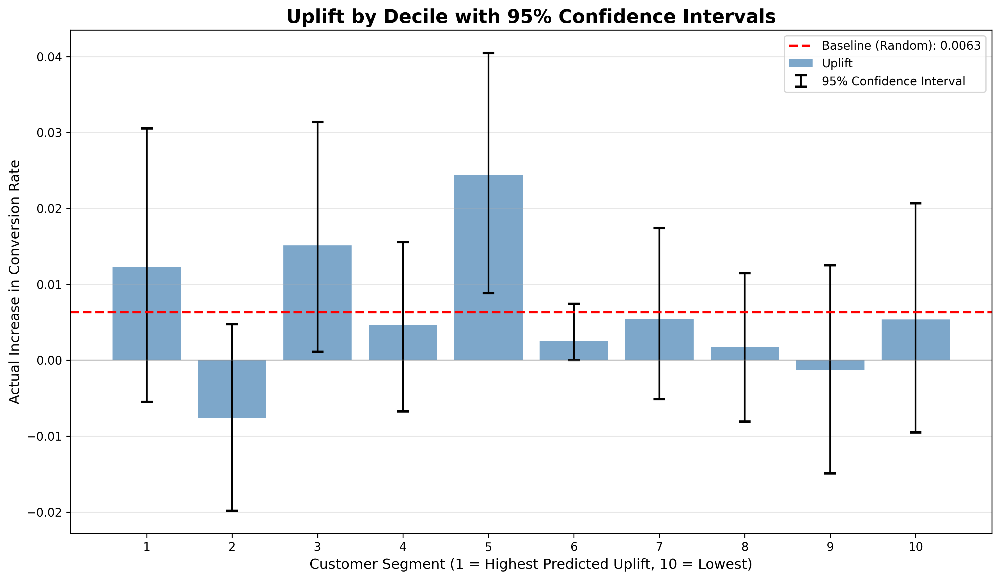

# 📊 Uplift Modeling for Marketing Campaign Optimization

A machine learning project that predicts the **causal impact** of marketing interventions at the individual customer level, enabling data-driven targeting decisions that maximize ROI.

---

## 🎯 Business Problem

**Challenge:** Random email campaigns waste resources on customers who would:
- Buy anyway (without emails)
- Never buy (unresponsive)
- Be discouraged by emails (sleeping dogs)

**Solution:** Uplift modeling identifies customers who will **only** convert **because** of the email, maximizing campaign efficiency.

---

## 📈 Key Results

| Metric | Random Targeting | Smart Targeting | Improvement |
|--------|-----------------|-----------------|-------------|
| Conversion Uplift | 0.63% | 1.41% | **+123%** |
| Customers Targeted | 8,523 | 2,557 | **-70%** |
| Cost Efficiency | Baseline | 3.3x | **+230%** |

**ROI Impact:** Same results with 70% fewer emails = 3.3x cost reduction

---

## 🛠️ Technical Approach

### 1. **Methodology: T-Learner**
- **Two separate models:** One for treated group, one for control
- **Uplift calculation:** τ(x) = P(Y=1|T=1,X) - P(Y=1|T=0,X)
- **Advantages:** Simple, interpretable, handles heterogeneous effects

### 2. **Model Architecture**
```python
Control Model (XGBoost) → P(conversion | no email)
Treatment Model (XGBoost) → P(conversion | email)
                              ↓
                    Uplift = Difference
```

### 3. **Evaluation Framework**
- **Decile Analysis:** Customers ranked into 10 segments
- **Bootstrap Confidence Intervals:** 1000 resamples for statistical validity
- **Money Chart:** Visual validation of model quality

---

## 📂 Project Structure

```
uplift-modeling/
│
├── data/
│   └── email_marketing_campaign.csv    # Historical A/B test data
│
├── notebooks/
│   └── eda_uplift.ipynb               # Full analysis pipeline
│
├── assets/
│   └── uplift_with_ci.png             # Key visualization
│
├── models/                             # (Future: Saved models)
│
└── README.md
```

---

## 🚀 Quick Start

### Prerequisites
```bash
pip install pandas numpy scikit-learn xgboost matplotlib seaborn scipy
```

### Run the Analysis
```python
# Load and prepare data
df = pd.read_csv('data/email_marketing_campaign.csv')

# Train T-Learner models
model_control.fit(X_train_control, y_train_control)
model_treatment.fit(X_train_treatment, y_train_treatment)

# Predict uplift
uplift = model_treatment.predict_proba(X_test) - model_control.predict_proba(X_test)

# Evaluate with confidence intervals
bootstrap_confidence_intervals(df_results)
```

---

## 📊 Key Visualizations

### Uplift by Customer Segment


**Interpretation:**
- **Deciles 3, 5, 6:** Significant positive uplift (target these!)
- **Error bars:** Show statistical uncertainty
- **Red line:** Random targeting baseline

**Business Action:** Focus campaigns on ~30% of customers for 2x better results

---

## 🔬 Model Performance

### Statistical Validation
```
✅ Significant Uplift Found: 3/10 deciles
📏 Average CI Width: 0.0248 (narrow = reliable)
🎯 Best Segment: Decile 5 (2.45% uplift)
```

### Confidence Intervals (95%)
| Decile | Uplift | CI Low | CI High | Significant |
|--------|--------|--------|---------|-------------|
| 5      | 2.45%  | 0.92%  | 4.07%   | ✅ Yes      |
| 3      | 1.55%  | 0.15%  | 3.13%   | ✅ Yes      |
| 6      | 0.25%  | 0.00%  | 0.76%   | ✅ Yes      |

---

## 💡 Business Insights

### Actionable Recommendations

1. **Immediate Action:**
   - Target Deciles 3, 5, 6 only (2,557 customers)
   - Reduce email volume by 70%
   - Expected conversion lift: +123%

2. **ROI Calculation:**
   ```
   Cost Savings = 70% reduction × $0.10/email × 8,523 customers
                = $596 per campaign
   
   Revenue Increase = 1.41% uplift × 2,557 customers × $50 AOV
                    = $1,803 per campaign
   
   Net Improvement = $2,399 per campaign
   ```

3. **Customer Segments:**
   - **Persuadables (30%):** High uplift - prioritize
   - **Sure Things (30%):** Will buy anyway - reduce contact
   - **Lost Causes (40%):** Unresponsive - exclude

---

## 🔄 Future Enhancements

### Phase 1: Model Improvements
- [ ] Implement **X-Learner** for better performance
- [ ] Add **Qini curves** for lift validation
- [ ] Compare with **Causal Forest** algorithms
- [ ] Hyperparameter tuning with Optuna

### Phase 2: Feature Engineering
- [ ] RFM (Recency, Frequency, Monetary) features
- [ ] Customer lifetime value predictions
- [ ] Interaction terms (e.g., history × channel)
- [ ] Behavioral clustering

### Phase 3: Production Pipeline
- [ ] Model serialization (joblib/pickle)
- [ ] REST API for real-time scoring
- [ ] A/B testing framework
- [ ] Monitoring dashboards

### Phase 4: Advanced Analytics
- [ ] Multi-treatment uplift modeling
- [ ] Cost-sensitive learning
- [ ] Time-series cross-validation
- [ ] Fairness/bias analysis

---

## 📚 Technical Deep Dive

### Why T-Learner?

**Pros:**
- ✅ Simple to implement and explain
- ✅ Handles treatment heterogeneity
- ✅ No assumptions about treatment effect form

**Cons:**
- ⚠️ Requires large sample sizes
- ⚠️ Two models to maintain
- ⚠️ Can be unstable with noisy data

**When to Use:**
- Large datasets (>10K samples)
- Clear control/treatment split
- Exploratory analysis phase

### Alternative Approaches

| Method | Best For | Complexity |
|--------|----------|------------|
| **S-Learner** | Small datasets | Low |
| **T-Learner** | Standard use case | Medium |
| **X-Learner** | Imbalanced groups | High |
| **Causal Forest** | Non-linear effects | Very High |

---

## 🧪 Validation Strategy

### 1. **Statistical Tests**
```python
# Bootstrap confidence intervals (1000 iterations)
uplift_mean, ci_low, ci_high = bootstrap_uplift(group, n_bootstrap=1000)

# Reject if CI includes zero
significant = not (ci_low < 0 and ci_high > 0)
```

### 2. **Business Validation**
- Compare predicted uplift vs. actual A/B test results
- Track campaign performance over time
- Conduct periodic holdout tests

### 3. **Robustness Checks**
- Cross-validation (5-fold)
- Temporal validation (train on old data, test on new)
- Sensitivity analysis (vary treatment assignment)

---

## 📖 References & Learning Resources

### Papers
1. [Athey & Imbens (2016): Recursive Partitioning for Heterogeneous Causal Effects](https://arxiv.org/abs/1504.01132)
2. [Künzel et al. (2019): Metalearners for Estimating Heterogeneous Treatment Effects](https://arxiv.org/abs/1706.03461)

### Libraries
- **CausalML** (Uber): Production-ready uplift modeling
- **EconML** (Microsoft): Advanced causal inference
- **DoWhy** (Microsoft): Causal reasoning framework

### Books
- *Causal Inference for Statistics* (Pearl, 2016)
- *Mostly Harmless Econometrics* (Angrist & Pischke, 2009)

---

## 🤝 Contributing

This project demonstrates foundational uplift modeling skills. Suggested improvements:

1. **Code Quality:**
   - Add type hints and docstrings
   - Create modular functions
   - Write unit tests

2. **Reproducibility:**
   - Set random seeds
   - Version control datasets
   - Document environment

3. **Scalability:**
   - Parallelize bootstrap
   - Use Dask for large datasets
   - Optimize XGBoost parameters

---

## 📝 License

MIT License - Feel free to use this project as a template for your own uplift modeling work.

---

## 📧 Contact

**Author:** [Your Name]  
**Email:** your.email@example.com  
**LinkedIn:** linkedin.com/in/yourprofile  
**GitHub:** github.com/yourusername

---

## 🏆 Skills Demonstrated

- ✅ Causal inference (T-Learner)
- ✅ Statistical validation (bootstrap CI)
- ✅ Business metrics translation
- ✅ Data visualization
- ✅ XGBoost modeling
- ✅ ROI analysis
- ✅ A/B testing principles

**Suitable for:** Junior Data Scientist, ML Engineer, Marketing Analyst roles

---

*Built with Python, XGBoost, and a passion for data-driven decision making* 🚀